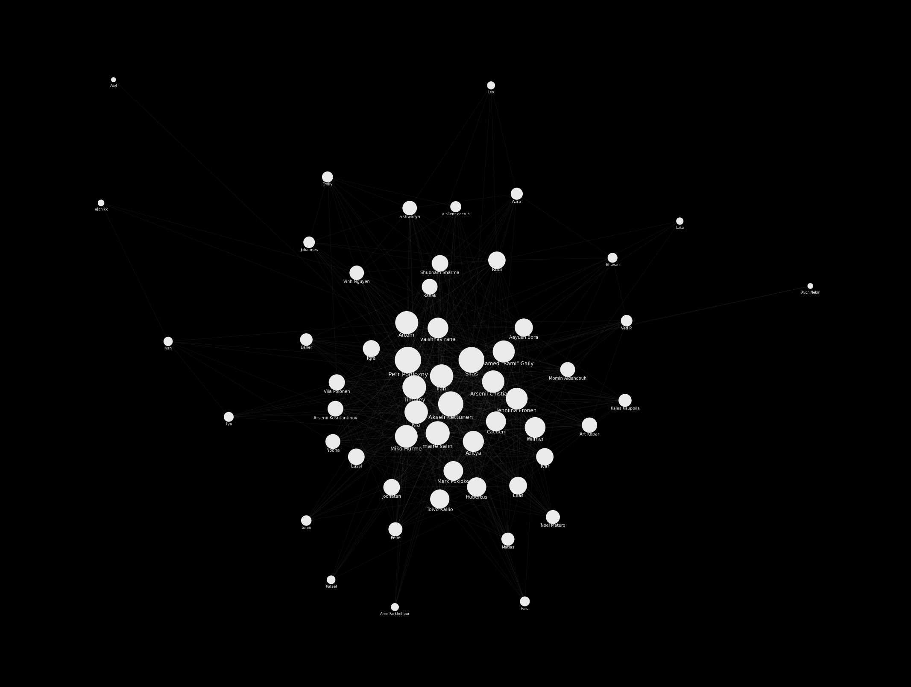

# stuhi-graph

A "who-knows-whom" social graph built from a Google Form where each person
selected everyone they know. The result is an interactive, Neo4j-Bloom-style
network you can explore in the browser.

**Live:** https://stuhi-graph-439502948711.europe-north1.run.app



## What's here

| File | What it is |
| --- | --- |
| `responses.csv` | Raw form export (one row per respondent + everyone they ticked). |
| `build_graph.py` | Parses the CSV into a graph, resolving name aliases. Emits `graph.json` + `graph-data.js`. |
| `graph.json` | The graph document: nodes (with degree) + edges (with mutual flag). |
| `graph-data.js` | Same data as `window.GRAPH`, so the viewer works over `file://`. |
| `index.html` | Interactive force-directed viewer (D3). |
| `plot_graph.py` | Renders a static `graph.png` (matplotlib spring layout). |

## The graph

- **57 people**, **627 links**, **335 mutual** ("we both named each other"), from **41 respondents**.
- An edge means at least one of the two people said they know the other.
- **Node size = number of connections.** Solid nodes filled the form; hollow
  rings were named by others but never responded.

Name resolution is the fiddly part: people signed the form with short names
("Adi", "Art", "Rami", "Vinh") while the checkboxes used full names
("Aditya", "Art Kobar", 'Mohamed "Rami" Gaily', "Vinh Nguyen"). `build_graph.py`
keeps an alias table (`ALIAS`) that merges these into one identity.

## Run it

```bash
# rebuild the graph after editing responses.csv
python3 build_graph.py

# (optional) re-render the static PNG
python3 plot_graph.py

# view the interactive version
python3 -m http.server 8117
# then open http://localhost:8117
```

## Deploy (Cloud Run)

The viewer is a static site served by nginx (`Dockerfile` + `nginx.conf`),
built with Cloud Build and hosted on Cloud Run.

```bash
IMAGE="europe-north1-docker.pkg.dev/cleveland-464404-m0/web/stuhi-graph:latest"

# build + push the container
gcloud builds submit --tag "$IMAGE"

# deploy (public)
gcloud run deploy stuhi-graph \
  --image="$IMAGE" --region=europe-north1 \
  --allow-unauthenticated --port=8080
```

Rebuild the graph (`python3 build_graph.py`) before building the image if
`responses.csv` changed.

## Viewer controls

- **Hover** a node to isolate its circle of friends.
- **Drag** nodes to rearrange; **scroll** to zoom; **drag** the background to pan.
- Sliders tune the physics (charge, link distance, link strength).
- The layout cools down and holds still — it does not jitter forever.
